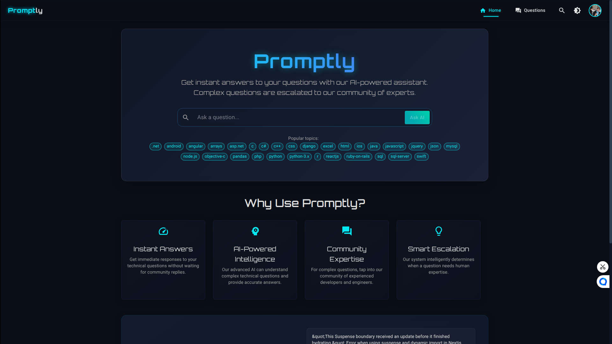
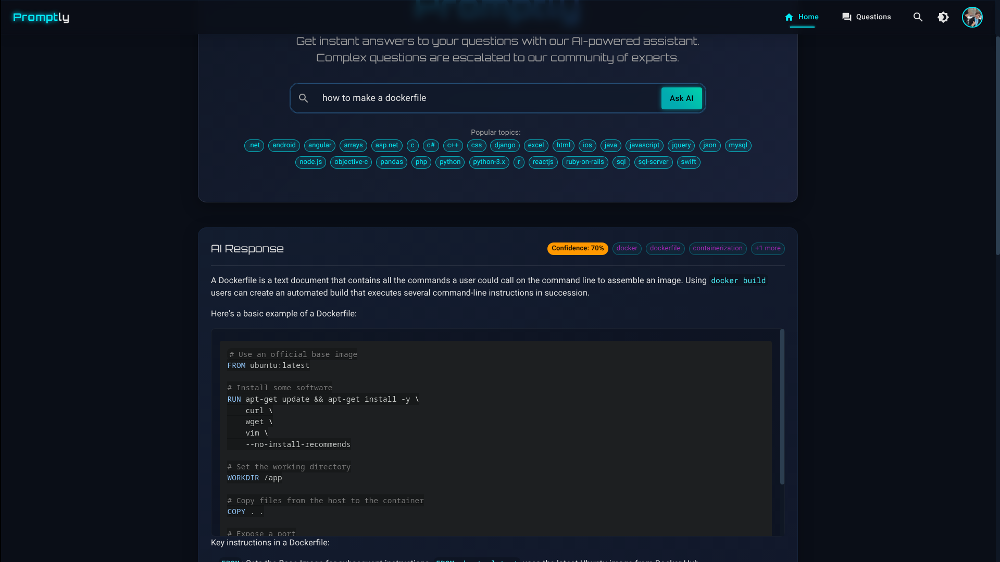
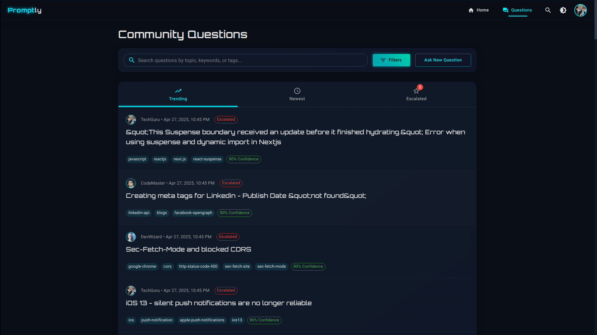
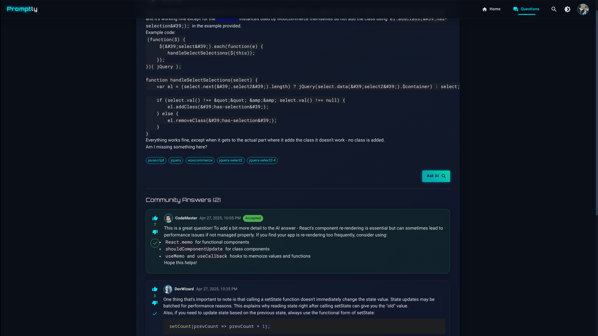
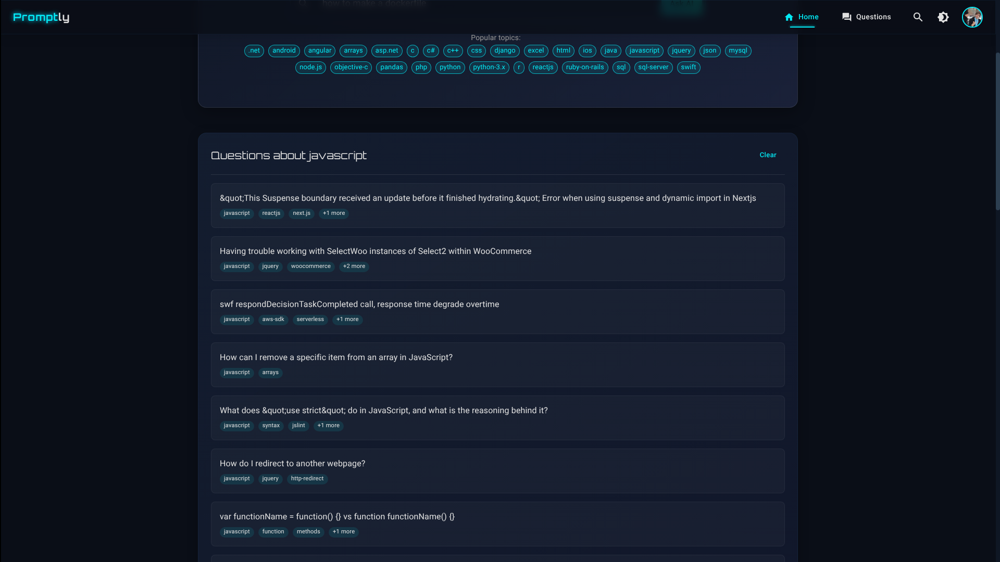

# 🚀 Promptly

**No question remains unsolved.**

---

Promptly is the next-generation, real-time Q&A and knowledge evolution platform for developer communities. Powered by blazing-fast streaming (Fluvio/Kafka) and LLMs (Ollama, Gemini), Promptly ensures every question is seen, answered, and used to make docs smarter—turning every Q&A into a catalyst for community growth.

---

## ✨ Why Promptly?

- **Never lose a question:** Every query streams instantly to the right eyes—AI or human experts.
- **Instant, live answers:** Q&A appears in real time; no more waiting or lost threads.
- **AI + Human Collaboration:** LLMs draft responses for straightforward queries; nuanced ones are routed to real experts.
- **Smart Clustering:** Recurring questions are grouped, highlighting documentation gaps and reducing repetition.
- **Continuous Feedback:** Upvotes, confusion, and escalations feed actionable insights back to maintainers and contributors.
- **Smarter Docs, Faster:** Maintainers and contributors see exactly where knowledge is missing.
- **Seamless Collaboration:** Perfect for open-source projects or internal teams—Promptly keeps everyone in sync, informed, and empowered.

---

## 🧠 Key Features

- **Structured LLM Analysis** (Ollama/Gemini):
  - Confidence scoring, auto-escalation, contextual tags
- **Few-shot Learning:**
  - Teaches models to respond reliably
- **Real-Time Streaming:**
  - Fluvio/Kafka pipeline, custom SmartModules for classification, ranking, clustering
- **JSON Output:**
  - Machine-readable, consistent for automation
- **Modular Design:**
  - `.env` driven config, easy provider/API swap
- **Beautiful UI:**
  - React + Material-UI, dark futuristic design, responsive

---

## 📁 Monorepo Structure

```
promptly/
│
├── backend/           # Node.js + Express + Gemini/Ollama API integration
│   ├── src/
│   ├── package.json
│   └── ...
│
├── frontend/          # React + TypeScript + Material-UI
│   ├── src/
│   ├── package.json
│   └── ...
│
├── llm_core/          # Python LLM prompt builders & analyzers (optional)
│   ├── prompt_builder.py
│   ├── llm_client.py
│   └── analyzer.py
│
├── .env               # Configuration file
├── requirements.txt   # Python dependencies
└── README.md          # This file
```

---

## ⚙️ Getting Started

### Prerequisites
- Node.js (>= 16.x)
- npm or yarn
- Python 3.8+ (for llm_core)
- Fluvio CLI & cluster ([Fluvio Quickstart](https://fluvio.io/docs/getting-started/))
- Google Gemini API key or Ollama local setup

### Setup

```bash
# 1. Clone the repo
$ git clone https://github.com/yourusername/promptly.git
$ cd promptly

# 2. Start Fluvio locally
$ fluvio cluster start

# 3. Backend setup
$ cd backend
$ npm install
$ npm run dev

# 4. Frontend setup
$ cd ../frontend
$ npm install
$ npm start

# 5. (Optional) Python LLM core
$ cd ../llm_core
$ pip install -r ../requirements.txt
```

### Environment Variables

Create a `.env` in the root or backend directory:

```dotenv
PORT=5000
GEMINI_API_KEY=your_gemini_api_key_here
GEMINI_MODEL=gemini-2.0-flash
OLLAMA_URL=http://localhost:11434/api/generate
USE_PROVIDER=ollama   # or gemini
MODEL_NAME=mistral    # or llama2, gemma, etc.
```

---

## 🏄‍♂️ How It Works

1. **Ask a Question:** Instantly broadcast your query to AI and/or human experts.
2. **Get Instant Answers:** Live, streaming responses—never wait for help.
3. **Feedback Loop:** Upvote, escalate, or flag confusion—Promptly learns and adapts.
4. **Docs Evolve:** Recurring questions cluster; maintainers see gaps, contributors get high-impact tasks.

---

## 📸 Screenshots







---

Promptly was built to solve the pain of lost questions and outdated docs in fast-moving developer spaces. Whether you’re in a global open-source project or an internal team, Promptly transforms every question into a catalyst for smarter documentation and faster answers.

---

## 😅 Challenges We Overcame

- **Real-Time Streaming Integration:** Custom hooks and robust state management for instant, reliable updates.
- **AI-Human Workflow Balance:** Dynamic eligibility scoring and intelligent routing.
- **Feedback Aggregation:** Multiple UI/UX iterations to capture and surface feedback without overwhelm.
- **Scalability & Performance:** Optimized backend and streaming architecture for high-volume, multi-source Q&A.
- **Maintaining Simplicity:** Powerful features, yet an intuitive and actionable user experience.

---

## 🤝 Contributing

We welcome contributions! Please see [CONTRIBUTING.md](CONTRIBUTING.md) for guidelines.

---

## 📄 License

MIT

---

## 💡 Inspiration

Promptly was inspired by the frustration of unanswered questions and the desire to make every developer community smarter, faster, and more collaborative.

---

## 🙌 Join Us

With Promptly, every question becomes a catalyst for smarter documentation and faster answers. No more waiting. Just real-time, intelligent support—right when you need it.

---

**Promptly: No question remains unsolved.**
